FLEXBOX IN REACT NATIVE.

Flexbox is used to specify the layout of a component in react-native. It is designed to provide a consistent layout on different screen sizes. It works in the same way in react-native with the CSS on the web with only a slight difference.
When using flexbox in a View, first we give a flex of “flex:1”. Here flex determines how the item fills the available space i.e where the View component is defined. The number 1 is how it knows what space to fill. As the number increases so as the space filled will be increased too. Below is a screenshot.

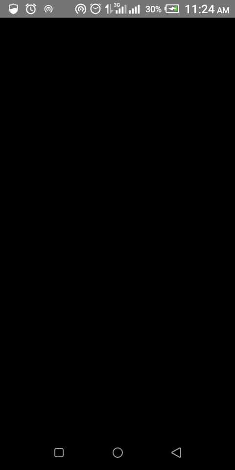
This is a parent container with a flex of 1 and backgroundColor of black
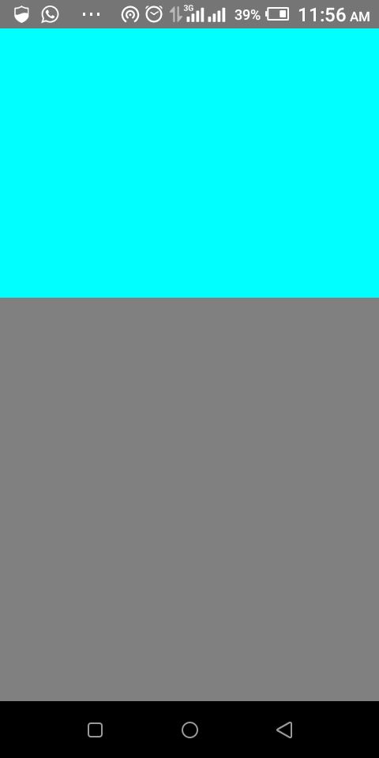
These are subViews inside the parent view. The View with the cyan backgroundColr has a flex "flex:2" and the grey has "flex:3"
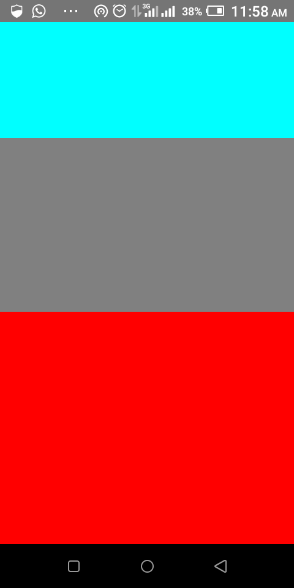
Here, the red View has a flex of 4

After defining the flex, the next thing to look out for is the flexDirection.
FlexDirection controls the way/direction in which components are laid out.
In react-native, the default value for flexDirection is "column". FlexDirection has other values as well such as "row", "row-reverse", "column-reverse".

flexDirection:"row" => aligns object from left to right.
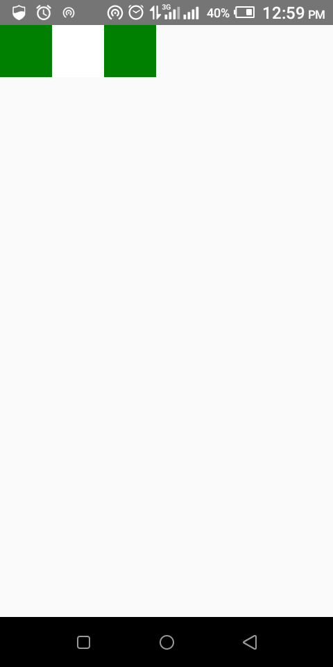

flexDirection:"row-reverse" => aligns object from right to left.
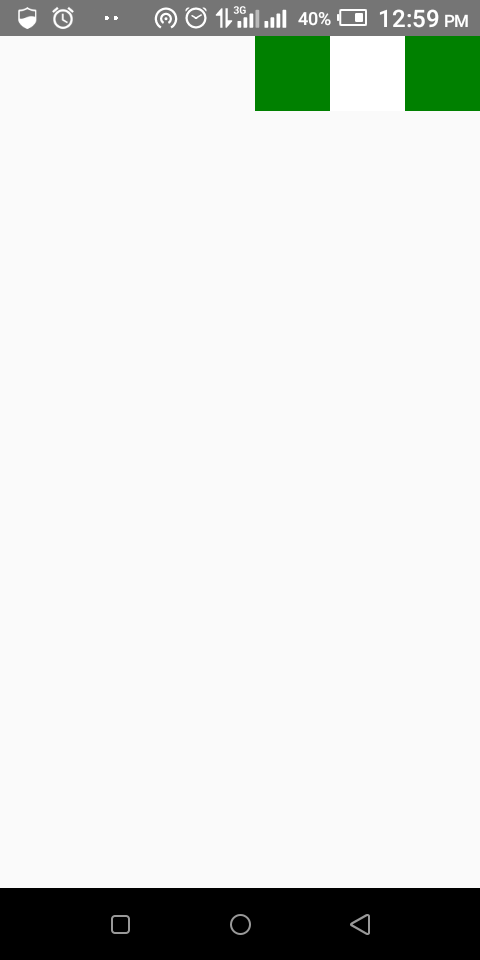

flexDirection:"column" => aligns object from top to bottom.
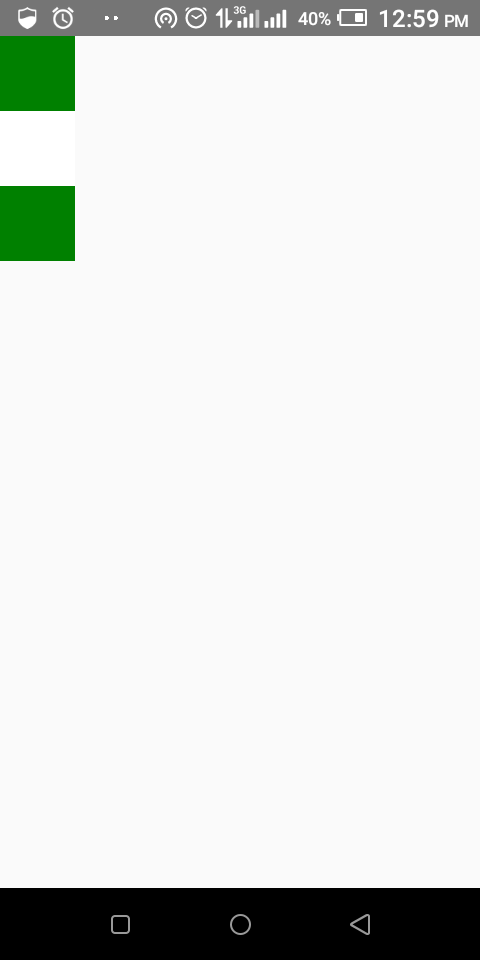

flexDirection:"column-reverse" => aligns object from bottom to top.

Another flexbox layout is JustifyContent.
JustifyContent is used to align components in the main axis of the container.

justifyContent:"flex-start" => this is the default value and it aligns contents of a container to the start of the container's main axis.

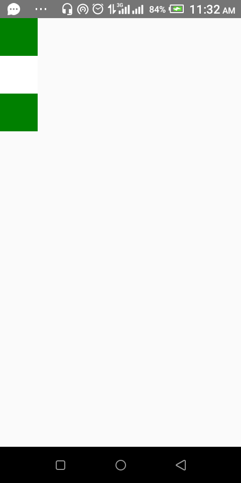

justifyContent:"flex-end" => this is used to align content of a container to the end of the container's main axis.

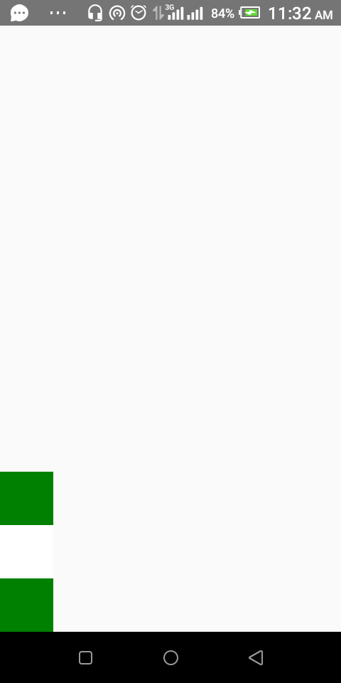

justifyContent:"center" => this is used to align content of a container in the center of the container's main axis.

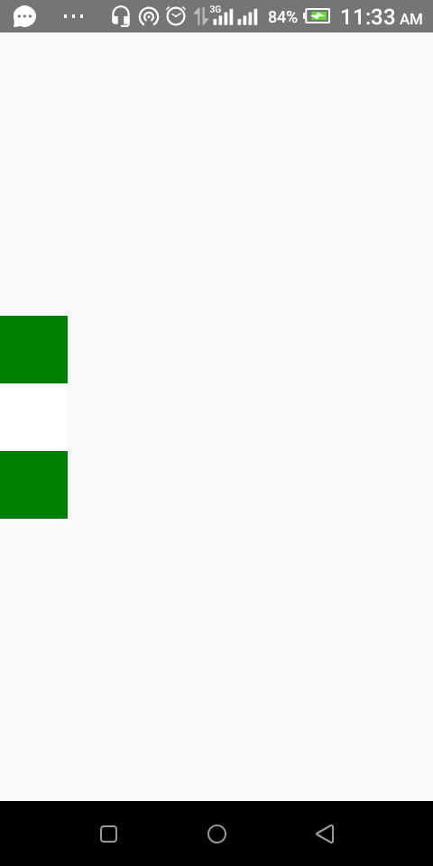

justifyContent:"space-between" => this is used to evenly space off content across the container's main axis sharing the remaining space between the content.

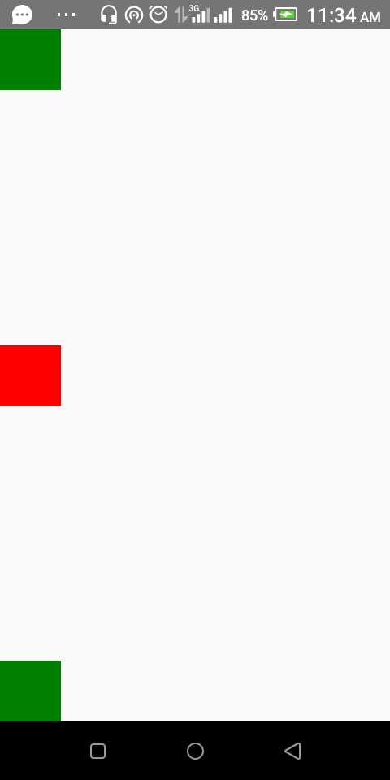

justifyContent:"space-around" => this is used to evenly space off content across the container's main axis, sharing the remaining space around the content. Compared to space-between, the use of space-around will result in space at the beginning of the first content and end of the last content.

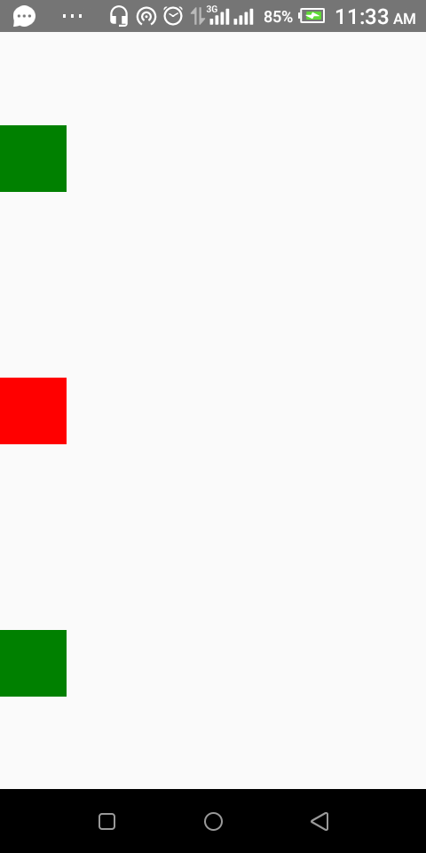

justifyContent:"space-evenly" => this is used to evenly distribute content within the alignment container along the main axis. The spacing between each pair of adjacent items, the main-start edge and the first item, and the main-end edge and the last item, are all exactly the same.

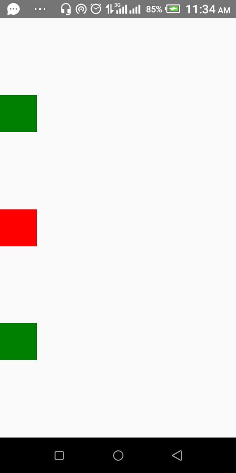

The next set of flexbox layout to look out for are Align-Items, Align-Content, Align-Self.

Align-Items describes how to align content along the cross axis of their container. It is very similar to justifyContent but instead of applying to the main axis, it applies to the cross axis. It has values of "stretch" (this is the default value), "flex-end", "flex-start", "center", "baseline"

alignItems:"stretch" => this is used to stretch the content of a container to match the height of the container's cross axis. The stretch is effective if that particlar item you want stretched has no width.
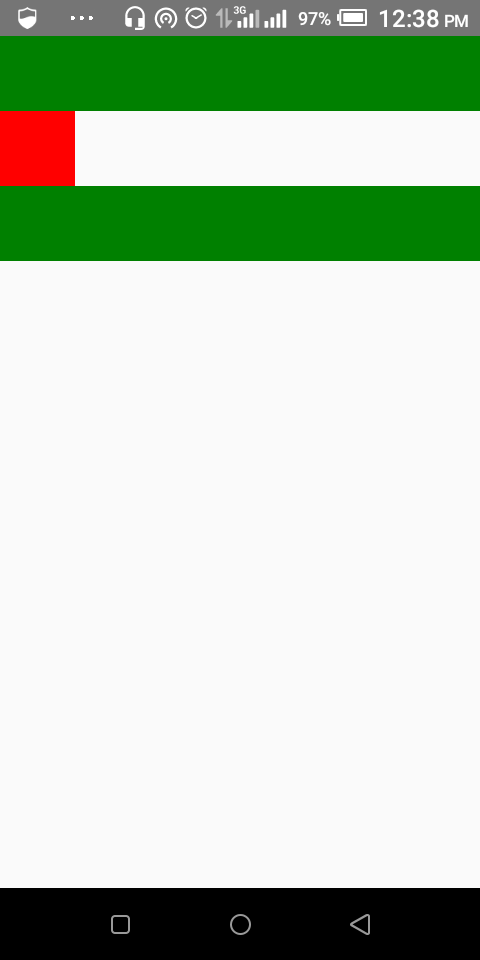

The green boxes are stretched because they have no width, but the red box has a width of 50

alignItems:"flex-start" => this is used to align the content of a container to the start of the container's cross axis. This is the same as the flex-start in justify-content.

alignItems:"flex-end" => this is used to align the content of a container to the end of the container's cross axis.
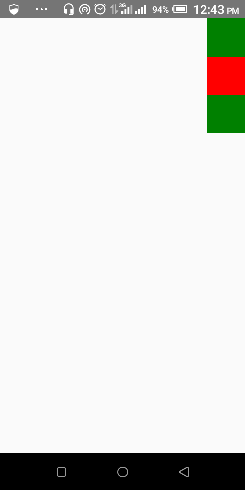

alignItems:"center" => this is used to align the content of a container in the center of the container's cross axis.
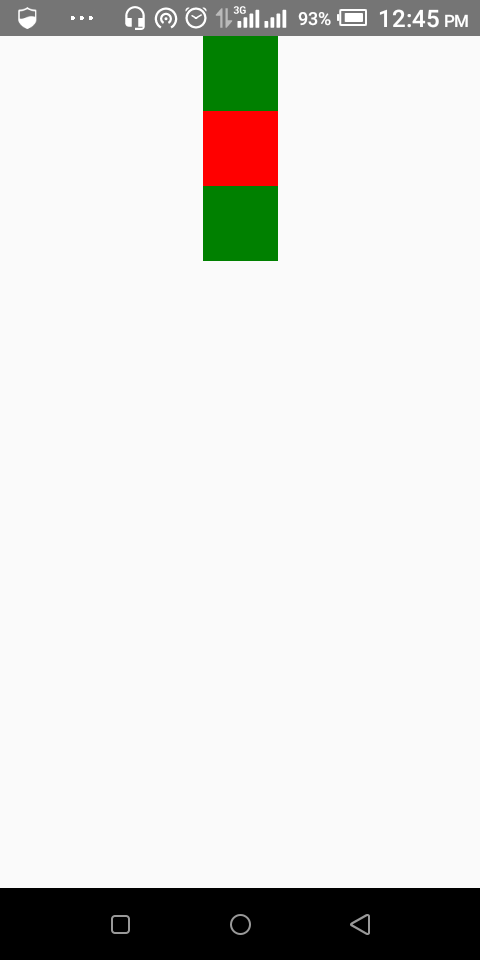

alignItems:"baseline" => this is used to align the content of a container along a common baseline.

Align-Self is used directly on the content instead of the container holding the content as we do in alignItems. It has the same values as alignItems and same effect.

<!--  -->

Align-Content defines the distribution of lines along the cross-axis. This only has effect when items are wrapped to multiple lines using flexWrap.

Absolute and Relative Layout
The position type of an element defines how it is positioned within its container.
position:"relative" => it is the default value for the position layout and 
position:"absolute" is the other value at which components can be layed out across the screens.
They are manipulated by values of "top", "right", "left", "bottom"